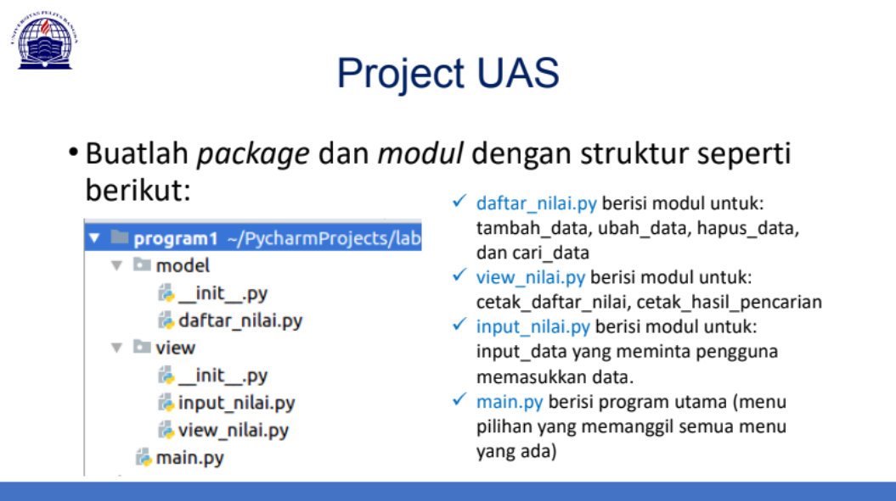

# UJIAN AKHIR SEMESTER (UAS)

Nama : Selma Ohoira

NIM : 312210727

Kelas : TI.22.C9

Mata Kuliah : Bahasa Pemograman

Soal

## Penjelasan
Pada project tersebut terdapat directory model dan view yang merupakan sebuah package yang di dalamnya terdapat sekumpulan modul python.
Yang dimana pada struktur diatas package model berisi modul daftar_nilai.py serta file python yang bernama __init__.py.
Sedangkan package view isinya terdapat modul input_nilai.py dan view_nilai.py serta file python juga yang bernama __init__.py.

Pada file python __init__.py berfungsi untuk memberi tahu python interpreter bahwa folder tersebut adalah sebuah package.
Jadi setiap direktori atau folder yang berisi modul constructor __init__.py akan diperilakukan sebagai package.
Sedangkan file python main.py berisi program utama (menu pilihan yang memanggil semua menu yang ada).

## Dokumentasi

Untuk dokumentasi dapat di download melalui <a href="UAS_Project.pdf">Dokumentasi</a>

## Demo Program

Untuk demo program bisa dilihat dengan cara mengunjungi Demo Program

Finish~