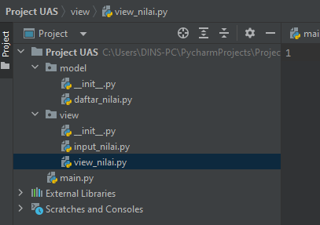

# UJIAN AKHIR SEMESTER

Nama : Selma Ohoira

NIM : 312210727

Kelas : TI.22.C9

Mata Kuliah : Bahasa Pemograman

## PACKAGE & MODULE
Soal

    daftar_nilai.py berisi modul untuk: tambah_data, ubah_data, hapus_data, dan cari_data
    view_nilai.py berisi modul untuk: cetak_daftar_nilai, cetak_hasil_pencarian
    input_nilai.py berisi modul untuk: input_data yang meminta pengguna memasukkan data.
    main.py berisi program utama (menu pilihan yang memanggil semua menu yang ada)

## Dokumentasi

Untuk dokumentasi dapat di download melalui Dokumentasi

## Demo Program

Untuk demo program bisa dilihat dengan cara mengunjungi Demo Program